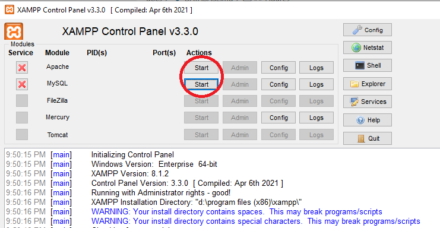
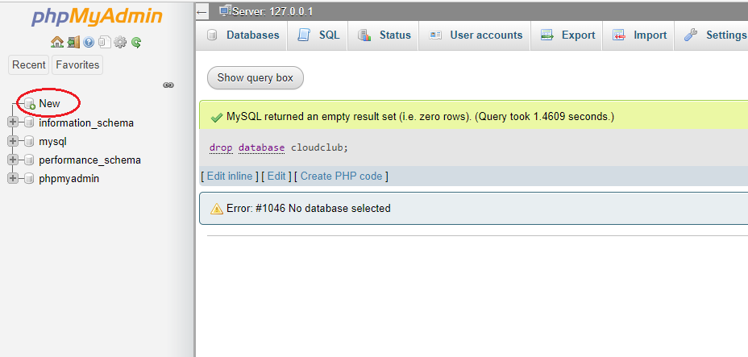
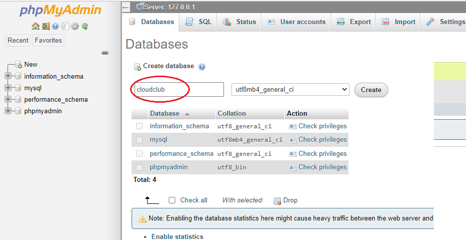
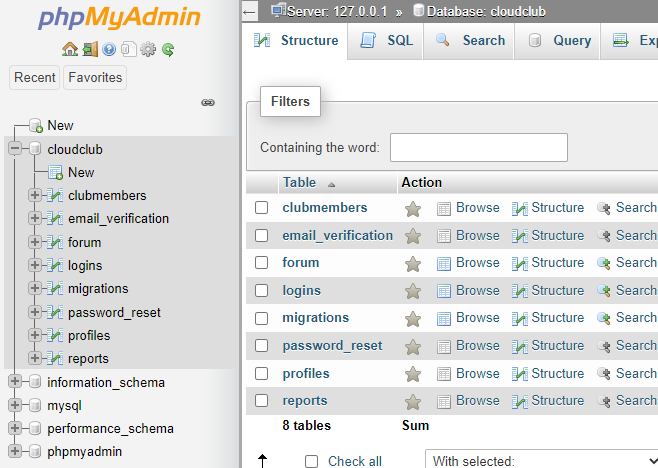

## Database setup

The cloud-club-website database relies on the db-migrate NPM module for revision control. All migrations are stored in the migrations directory.

## First time setup

1. Install XAMPP from the link provided in the root Readme.

2. Open the XAMPP Control Panel.

3. Click on the Start buttons for Apache and MySQL. (Fig 1.) This step will turn on the MySQL database and the Apache server.

4. In your browser, navigate to http://localhost/phpmyadmin/

5. In the left sidebar, click on New. (Fig. 2)

6. Enter `cloudclub` in the textbox and click on Create (Fig. 3).

7. In a terminal navigate to where you have clones this repository.

8. Run `npm i` in the command line to install all packages.

9. Run at the root of the repository: `npx db-migrate up --config .\database\database.json`

10. Refresh the phpmyadmin page to ensure that there are new tables inside it. (Fig 4.)

## Figures

### Figure 1.

### Figure 2.

### Figure 3.

### Figure 4.

